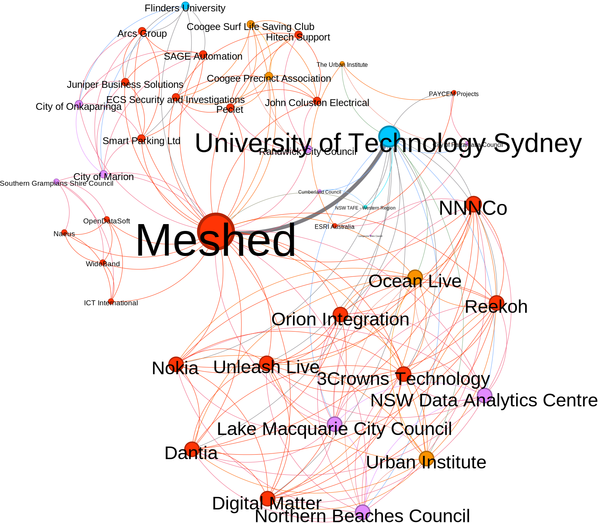

# About me
My name is Xiaolan CAI, and I am a PhD candidate at the [University of Canberra's News & Media Research Centre](https://www.canberra.edu.au/research/centres/nmrc/our-people). I have a background in urban planning (7+ years) and computational social research. My PhD project investigates **Open Source Smart City Projects and Impacts on Civic Engagement in Australia**. 

You can download my C.V [here](https://github.com/CaiXiaolan/CaiXiaolan.github.io/blob/main/docs/assets/C.V_Xiaolan%20Cai.pdf)

# About my project  

## What it is about?  
  
My PhD project aims to examine the relation between **open source technologies** and **local communities** in the context of **smart cities**, and evaluate to what extent these community-led, open source technology-based, smart cities models could enhance **civic engagement** in Australia. I understand civic engagement as the involvement of local communities in public policy deliberation and implementation.

## How will it be conducted?  
  
I am using online research methods (e.g., web-scraping and data collection with APIs from social media platforms) and ethnographic methods (e.g., observations, interviews and documents collection) to collect data for this research project. The information gained from the research will be used to:  
- Identify successful development patterns for Australian open source smart city projects.  
- Make policy recommendations to empower local communities.  
- Create tools to develop civic impacts that could be easily adopted by local communities.  
 
## How will the data be analysed?  

[Social network analysis (SNA)](https://en.wikipedia.org/wiki/Social_network_analysis) & [Thematic analysis](https://en.wikipedia.org/wiki/Thematic_analysis) will be conducted to map the dynamics between open source technologies, local communities and the urban issues people are concerned about.  

- **Social network analysis**  

This graph represents entities which have received Australian federal government funding to develop smart community projects. Organizations are linked when they have been involved in common projects. Node size represents how many projects an organization engaged in, and tie width reflects the number of projects two organizations collaborated on.  

>   
> 
> _Figure 1: Partner network of Australian Federal government supported smart community projects_  

- **Thematic analysis**  
_Coming soon_  

## Where will be the data stored and for how long?
  
All data for this project will be stored in a password-protected computer at the University of Canberra and backed up in UC's password-protected network drive space. They will be kept for 5 years after my graduation in UC's password-protected network drive space.
  
## Who can access these data?

Myself and my supervisory panel members.   

# My supervisory panel
- Primary supervisor: Professor of Communication [Mathieu O'Neil](https://researchprofiles.canberra.edu.au/en/persons/mathieu-oneil), News & Media Research Centre, University of Canberra.
- Secondary supervisor: [Dr. Momoko Fujita](https://researchprofiles.canberra.edu.au/en/persons/momoko-fujita), News & Media Research Centre, University of Canberra.
- Advisor: Professor of Urban Planning [Barbara Norman](https://researchprofiles.canberra.edu.au/en/persons/barbara-norman), Canberra Urban and Regional Futures, University of Canberra.

# My publications

- O’Neil, M., Cai. X, Muselli, L., M. & Zacchiroli, S. (2022). [Co-producing industrial public goods on GitHub: Selective firm cooperation, volunteer-employee labour and participation inequality](https://upsilon.cc/~zack/research/publications/nms-2022-industrial-public-goods.pdf). *New Media and Society*.    
- O’Neil, M., Khan, I., Holland, K. & Cai. X. (2022). [Mapping the connections of health professionals to rumour-based and factual COVID-19 hashtags in the Australian Twittersphere](https://www.tandfonline.com/doi/full/10.1080/1369118X.2022.2032260). *Information, Communication & Society*.  
- O’Neil, M., Cai, X., Muselli, L., Pailler, F., & Zacchiroli, S. (2021). [The coproduction of open source software by volunteers and big tech firms](https://apo.org.au/node/312607). *News and Media Research Centre*.   
